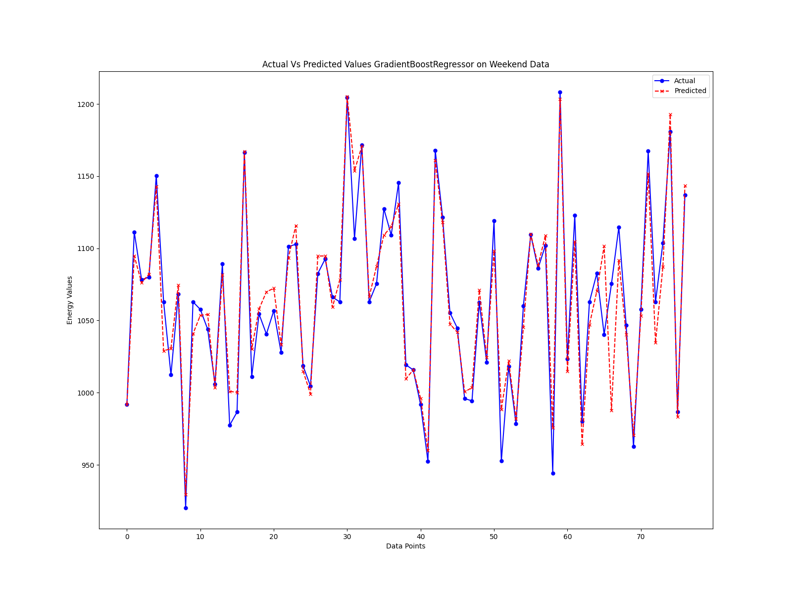

# AESO Forcast Analysis
This project performs energy consumption forecasting using two different machine learning models: Gradient Boosting Regressor and Support Vector Regression (SVR). The script is designed to analyze and predict energy consumption patterns for different seasonal periods and under the influence of external factors such as COVID-19. It utilizes various data preprocessing techniques, model training, and visualization to achieve accurate forecasts.


## Pipeline Overview


### Data Loading: 
The script loads energy consumption data from an Excel file, allowing flexibility in data source and format.
### Data Preprocessing: 
It includes data cleaning and filtering based on seasonal patterns and correlation thresholds.
### Model Training:
#### Gradient Boosting Regressor: 
The script trains a Gradient Boosting Regressor model with a customizable set of hyperparameters using GridSearchCV. The model is trained and evaluated on the selected data slice.
#### Support Vector Regression: 
The script uses SVR with GridSearchCV to find the best hyperparameters and trains the SVR model.
### Visualization:
The script generates line plots to visualize actual and predicted energy consumption values for different data slices, including general data, summer data, weekends, and COVID-affected weekends.
### Statistics:
The script provides statistics for the selected data slice, offering insights into the correlation and distribution of variables.

## Usage:

The script is designed to be highly configurable through command-line arguments. Users can specify data paths, model paths, data slices, phases (train, predict, statistics), and correlation thresholds to tailor the analysis to their needs.

## Note:

Ensure you have the necessary libraries and dependencies installed as per the script's requirements.
The script supports various seasonal data slices, such as summer, weekends, and COVID-affected weekends, making it adaptable for different scenarios.
## Author: 
Sara Naseri Golestani


## Installation

In the terminal of the project root directory run:


1. Run `conda env create -f environment.yml` to create the environment
2. `conda activate aeso`

## Config 

1. The `DATA_SLICE` given in the `config.yaml` is a specified portion of data that you want to proceed with it could be from any of the following options: `['General', 'Summer', 'Fall', 'Winter', 'Spring', 'Weekend', 'COVID Weekend', 'COVID']`. 
2. Next you will choose to select a specific operation to be done with your choice of data. it could be any of the following options: `['train', 'predict', 'statistics']`
3. Lastly, under `PATHS`  set `DATA/MODEL` to where the data/model is located and could be loaded from there. and set `TH` for a threshold you want the correlation between the selected features to be. 
4. Note: if you have not run the train step for your data before, you cannot use the prediction option since there are no pre-trained model to evaluate with them. 

## Pipeline

Now that you have set your config to the values you prefer, simply run the following command in your terminal:
```
python main.py
```

## Demo

In order to have a better sense of the processes in the pipeline, the notebook file `demo.ipynb` has demonstrated the steps. 


## Model Performance 

### Evaluation data
- The model is evaluated on a randomly selected data using sklearn package. in seasonal cases, the last season is our point of turn for evaluation (test) data. 
### Evaluation Metrics 

R-Squared, the closer to 1, the better the performance is.  It measures the proportion of the variance in the dependent variable (target) that is explained by the independent variables (features) in the model. In simpler terms, R-squared quantifies how well the model's predictions fit the actual data points.

---
### Example

The following ,etrics and evaluations are done on `Weekend` data. 



The metrics are: 
```angular2html
Mean Squared Error: 346.63942068302686
Mean Absolute Error: 12.455820542798355
R-squared: 0.9118940412155692
```

---
